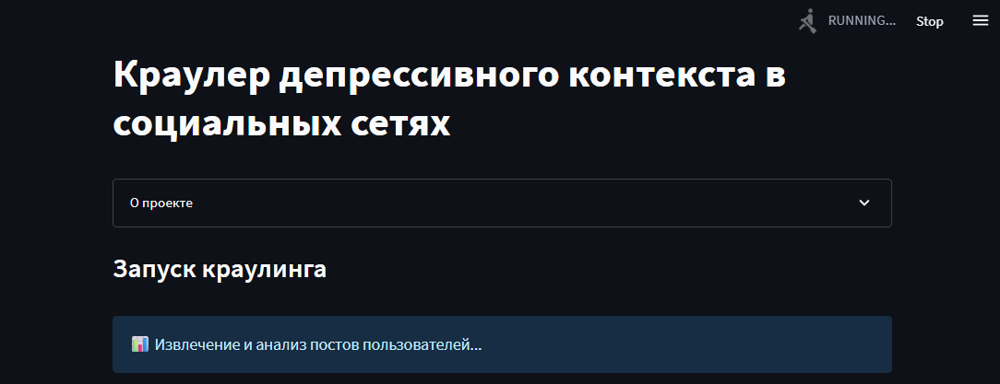
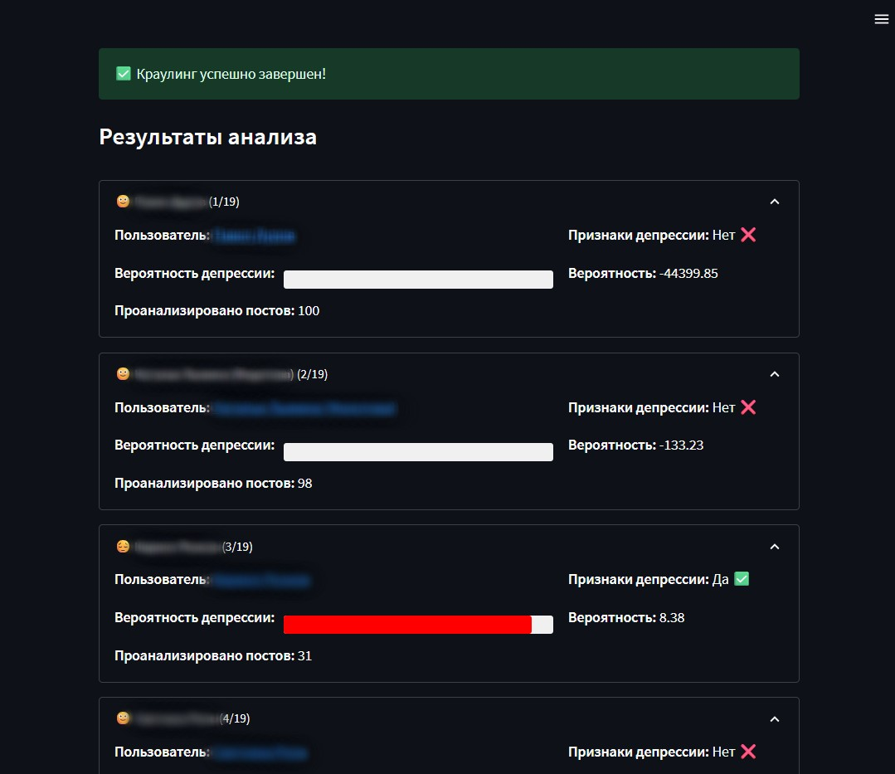

# Веб-интерфейс для краулера депрессивного контекста

Это веб-приложение на базе Streamlit, которое предоставляет удобный графический интерфейс для работы с краулером депрессивного контекста ВКонтакте.

## Возможности

- Интуитивно понятный пошаговый интерфейс для запуска краулера
- Ввод списка пользователей вручную или через файл
- Настройка параметров краулинга (глубина сбора, видимость браузера)
- Отображение процесса краулинга с информативными сообщениями
- Улучшенная визуализация результатов анализа и статистики
- Возможность скачивания результатов в JSON-формате

## Запуск приложения

Для запуска приложения выполните следующую команду из корневой директории проекта:

```bash
streamlit run app/app.py
```

## Использование

1. В интерфейсе приложения введите список пользователей для анализа (ID или URL-адреса) или загрузите файл со списком пользователей
2. Введите данные для входа в ВКонтакте (логин и пароль) или пропустите этот шаг для доступа только к открытым профилям
3. Настройте дополнительные параметры (количество прокруток, видимость браузера)
4. Нажмите кнопку "Запустить краулинг"
5. Во время выполнения вы увидите информационные сообщения о текущих этапах обработки
6. После завершения процесса просмотрите детальные результаты анализа

## Последние улучшения

- **Улучшенный процесс отображения** - Интерфейс теперь показывает понятные информационные сообщения, которые последовательно меняются во время работы краулера
- **Более детальная аналитика** - Результаты анализа включают точную информацию о количестве проанализированных постов для каждого пользователя
- **Оптимизированный интерфейс** - Добавлены визуальные индикаторы процесса и наглядное представление вероятности депрессии
- **Улучшенная обработка ошибок** - Более информативные сообщения об ошибках и их детальное отображение

## Структура приложения

Приложение имеет модульную структуру, разделенную на логические компоненты:

```
app/
|-- app.py                   # Основная точка входа
|-- common/                  # Общие компоненты
|   |-- __init__.py
|   |-- session.py           # Управление сессией и состоянием
|   |-- ui.py                # Общие UI компоненты
|   |-- crawler.py           # Утилиты для работы с краулером
|-- steps/                   # Шаги приложения
|   |-- __init__.py
|   |-- step1_users.py       # Шаг 1: Ввод пользователей
|   |-- step2_auth.py        # Шаг 2: Аутентификация
|   |-- step3_params.py      # Шаг 3: Параметры
|   |-- step4_crawler.py     # Шаг 4: Запуск и результаты
|-- temp/                    # Временные файлы и результаты
|-- assets/                  # Скриншоты и изображения
```

### Описание модулей

#### common/session.py
Управление состоянием приложения, инициализация сессии, функции для переходов между шагами.

#### common/ui.py
Общие компоненты пользовательского интерфейса, настройка страницы, информационные блоки.

#### common/crawler.py
Функции для взаимодействия с краулером: формирование команды, запуск процесса, отображение статуса и результатов. Включает последовательное отображение информационных сообщений во время выполнения.

#### steps/step1_users.py - steps/step4_crawler.py
Отдельные шаги пользовательского интерфейса, каждый в своем модуле для лучшей организации кода.

## Анализ результатов

Приложение показывает следующую информацию для каждого проанализированного пользователя:
- Основная информация профиля и ссылка на страницу ВКонтакте
- Вероятность депрессии с визуальным индикатором
- Количество проанализированных постов 
- Общую статистику по всем пользователям

## Скриншоты приложения

### Стартовая страница


### Страница авторизации


### Настройка параметров


### Процесс краулинга



### Результаты анализа



## Требования

- Python 3.7+
- Установленные зависимости из requirements.txt
- Доступ к интернету и ВКонтакте 